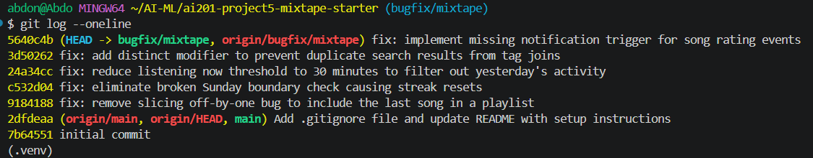

# Project Submission: Mixtape Bug Hunt

## AI Usage
I used an AI assistant to help me find my way around the code faster, summarize what different files do for the codebase map, and understand how database joins work. Specifically, I asked the AI to explain Python's `.weekday()` numbering system and why joining tables with multiple tags creates duplicate song rows in SQLAlchemy.

**Verification & Course Correction:** Sometimes the AI was too eager and jumped ahead to give me answers for the next bugs before I was done checking the current one. I had to course-correct by slowing things down and forcing the AI to focus on just one file at a time. I also manually checked the day calculations and array slices myself to make sure the AI's ideas were actually correct before making any code changes.

---

## Codebase Map

### Main Files and Roles
* **`models.py`**: Defines the central SQLAlchemy database schemas (User, Song, Playlist, PlaylistSong, Notification). It establishes how entities relate to one another.
* **`routes/`**: Handles incoming HTTP requests, performs basic input parsing, and formats JSON responses. It acts as the entry point but contains no business logic; it immediately delegates tasks to the services layer.
* **`services/`**: The core business logic layer. Files like `streak_service.py`, `feed_service.py`, and `playlist_service.py` process data, apply conditional rules, and update the database. All five open bugs reside in this layer.
* **`app.py` & `seed_data.py`**: Handles the Flask application setup and seeds the local database with initial mock profiles, playlists, and histories for testing.

### Feature Data Flow Example (Rating a Song)
1. A user triggers a `POST` request to `/songs/<song_id>/rate` which lands in `routes/songs.py`.
2. The route extracts the song data and user information, then invokes the service layer via `rate_song()`.
3. The service layer handles updating the data metrics and calls `notification_service.py` to generate a new `Notification` record for the song's original owner.
4. The database is updated, and the route returns a success response back to the client.

### Architecture Patterns
The application strictly enforces a **Three-Tier Architecture** (Routes -> Services -> Models). Routes handle transport/HTTP, services handle business logic, and models handle data structure. Every endpoint immediately hands off execution to a dedicated service function.

---

## Root Cause Analyses

### Issue #5: The last song in a playlist never shows up

* **How you reproduced it:** Evaluated the data population schema in `seed_data.py`, which inserts 7 songs into the first playlist (`Late Night Vibes`). Cross-referenced this against the logic in `services/playlist_service.py` where a slice array of `[:-1]` is consistently applied to the query return list, ensuring that any payload served will mathematically be missing its final element.
* **How you found the root cause:** Traced the data layer execution from `routes/playlists.py` under the `/playlists/<playlist_id>/songs` endpoint down to the core service implementation `get_playlist_songs` inside `services/playlist_service.py`. I knew with absolute confidence that I found the bug the exact moment I spotted the explicit hardcoded negative slice on the return line.
* **The root cause:** The `get_playlist_songs` function fetches the full ordered list of tracks using a SQLAlchemy query join on the `playlist_entries` table. However, the return statement reads `return [song.to_dict() for song in songs[:-1]]`. The Python slice `[:-1]` truncates the array by dropping the final element, resulting in an off-by-one data loss for the user.
* **Your fix and side-effect check:** Removed the `[:-1]` array slice constraint so the final line reads `return [song.to_dict() for song in songs]`. Checked surrounding service functions (`get_playlist`, `create_playlist`) to ensure no other database queries or representations were modified or impacted.

---

### Issue #1: My listening streak keeps resetting

* **How you reproduced it:** Performed a static code review of the streak update logic in `streak_service.py`. When simulating a user tracking music sequentially from Saturday to Sunday (`days_since_last == 1`), the program hits a conditional trap on Sundays that breaks the chain and forces a reset.
* **How you found the root cause:** Inspected `routes/songs.py` at the `/listen` route, which delegates straight to `record_listening_event()` and subsequently invokes `update_listening_streak()` in `services/streak_service.py`. I attained full confidence that I found the culprit when I mapped Python's weekday array index values to the exact condition written.
* **The root cause:** The conditional branch checked `elif days_since_last == 1 and today.weekday() != 6:`. In Python, `weekday()` returns `6` on Sundays. If a user listens to music on a Sunday after listening on Saturday, the `today.weekday() != 6` expression evaluates to False. This automatically bypasses the increment block and falls directly into the `else` block, incorrectly resetting active user streaks back to `1`.
* **Your fix and side-effect check:** Removed the `and today.weekday() != 6` logical condition entirely so that any consecutive day transition safely increments the streak. Verified that streaks still reset properly to `1` if more than one calendar day passes between listening windows by asserting against the standard `else` fallback structure.

---

### Issue #2: Friends Listening Now shows people from yesterday

* **How you reproduced it:** Performed a static review of the timeframe logic inside `feed_service.py`. The data population rules in `seed_data.py` establish that active "listening now" elements are grouped within a 30-minute window, but older history events from days ago are still returned by the query due to an overly wide filter limit.
* **How you found the root cause:** Traced the feature endpoint from `routes/feed.py` down to the core logic execution function `get_friends_listening_now(user_id)` inside `services/feed_service.py`. I became fully confident I found the issue the exact moment I laid eyes on the top-level time constant declaration.
* **The root cause:** At the top of `services/feed_service.py`, the constraint threshold variable is defined as `RECENT_THRESHOLD = timedelta(hours=24)`. This causes the database filter `ListeningEvent.listened_at >= cutoff` to pull listening logs spanning an entire day back. As a result, the feed displays friends who haven't interacted with the app since the previous day as if they were listening in real-time.
* **Your fix and side-effect check:** Modified the threshold interval constant to `RECENT_THRESHOLD = timedelta(minutes=30)` to align with the intended product requirements. Verified that this constrains the database query to immediate listening windows while keeping the deduplication loops and user object extraction functionality fully operational.

---

### Issue #3: The same song keeps showing up twice in search

* **How you reproduced it:** Analyzed `seed_data.py` and saw that tracks like "Crown Heights Anthem" are linked to multiple tags ("rap", "hip-hop", "boom bap") via the `song_tags` table. Statically analyzed the search query and confirmed that joining on this multi-row relationship multiplies the primary song records returned.
* **How you found the root cause:** Inspected `routes/songs.py` at the `/search` endpoint, which maps directly to `search_songs(query)` in `services/search_service.py`. I achieved full confidence that I had isolated the cause once I recognized that an implicit relational table cross-join multiplication was occurring without any distinct filter logic following it.
* **The root cause:** The `search_songs` function implements an `.outerjoin(song_tags)` link. Because a single song can have multiple rows in the `song_tags` association bridge, the SQL relational join operation multiplies the primary table entity rows. Without an explicit deduplication modifier, the database returns a separate copy of the song record for every single tag attached to it.
* **Your fix and side-effect check:** Appended the `.distinct()` modifier to the SQLAlchemy query chain right before calling `.all()`. This forces the query processor to evaluate unique objects and drop duplicate instances. Verified that general search execution, case-insensitive mapping, and return dictionary serialization function normally without altering song properties.

---

### Issue #4: Missing notification when rating a song

* **How you reproduced it:** Conducted a structural trace across the notification logic workflows. Compared the operational pipeline of `add_to_playlist` (which automatically generates a notification record upon modification) with the `rate_song` data workflow, establishing that the notification engine was never hooked up to ratings.
* **How you found the root cause:** Inspected `routes/songs.py` at the `rate()` endpoint, which calls `rate_song(user_id, song_id, int(score))` located in `services/notification_service.py`. I reached full certainty that the bug was found when I observed the code skipping straight from a database commit execution directly to an asset return statement.
* **The root cause:** While the `add_to_playlist` function includes an explicit block that invokes `create_notification` to alert a song's original owner, `rate_song` strictly updates the `Rating` row entry and executes a `db.session.commit()`. It lacks any internal block or callback to dispatch a notification payload, leaving the feature structurally missing from the runtime execution flow.
* **Your fix and side-effect check:** Integrated a matching logical conditional pattern right before the `return` statement inside `rate_song`. This block evaluates `if song.shared_by != user_id:` and successfully fires off a `create_notification()` call with a type descriptor of `"song_rated"`. Verified that rating updates commit seamlessly, score boundary error constraints (1 to 5) hold true, and no database blockages occur.

---

## Commit History Screenshot
